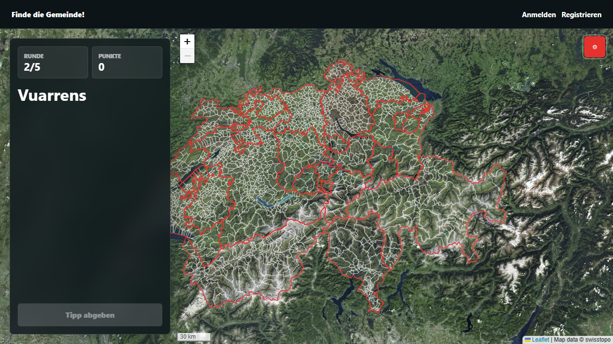
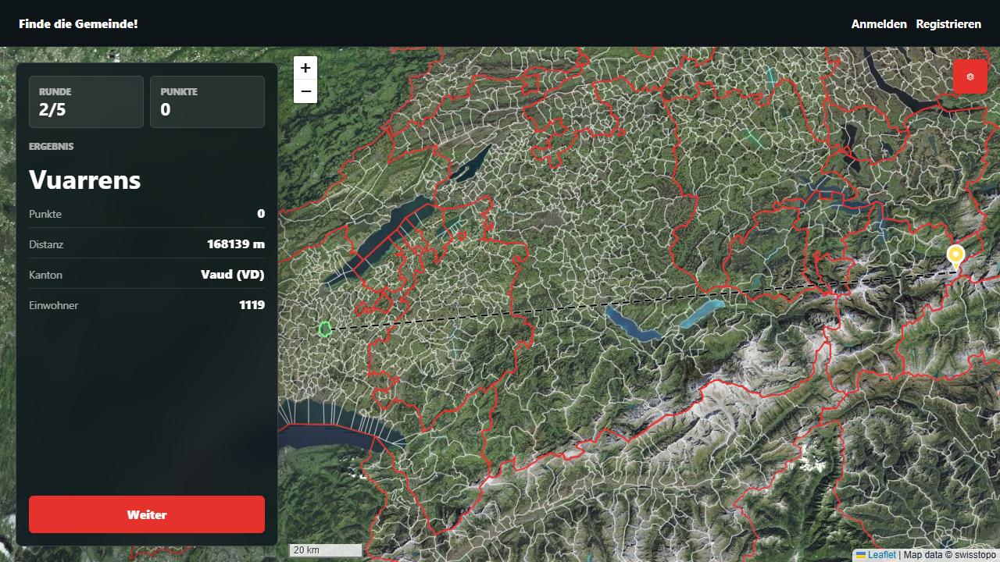

# Gameplay

Find the Municipality! is a map guessing game about Swiss municipalities and
villages. Each round shows one target name, and the player tries to place a pin
inside that target area on the map.



## Game Flow

A normal game has five rounds.

1. Choose a game mode and target type.
2. Start the game as a guest or with an account.
3. Read the target name in the sidebar.
4. Move around the map and place a pin.
5. Submit the guess.
6. Review the reveal: target area, pin, distance, score, canton, and population.
7. Continue until all five rounds are finished.
8. Open the summary to review all rounds on one map.

The game does not show target names before a guess. It shows boundaries, canton
outlines, and the selected background map so the player has geographic context
without direct labels.

## Starting A Game

The start screen shows the map first and keeps setup controls in the sidebar.
Players first choose the map scope:

- `Switzerland`: targets can be any active municipality in Switzerland.
- `Single canton`: targets are limited to the selected canton.

Players then choose what to find:

- `Municipalities`: the classic mode. The target polygons are municipalities.
- `Villages`: target polygons are village/locality boundaries.

The game mode, target type, and canton are persisted on the game record. This
matters for scoring, history, summary replays, profile statistics, and the "play
again" action.

## Guest And Account Play

Anonymous visitors can play without an account. Guest games are linked to a
browser-owned guest key, so the same browser can continue an active guest game
or view its just-finished summary.

Account play adds permanent user-owned features:

- finished-game history
- profile statistics
- recent games
- future account-based features

Guest games are intentionally not migrated into account history. If a player
wants long-term history and statistics, they should log in before playing.

## Map Modes

### Switzerland

Switzerland mode uses all active targets of the selected target type from the
current geodata dataset. The map starts zoomed to Switzerland, and the score
curve is based on the full playable Swiss extent.

### Single Canton

Single-canton mode limits the game to targets in one selected canton. The map
loads canton-scoped boundary data, starts focused on that canton, and uses a
canton-sized score curve. History, summary, profile statistics, and admin labels
show the canton abbreviation, such as `ZH` or `VD`.

## Target Types

### Municipalities

Municipality games use official municipality polygons as targets. They can be
played across Switzerland or inside one canton.

### Villages

Village games use official village/locality polygons as targets. They behave
like municipality games: five rounds, the same scoring system, the same summary
and history replay, and the same account statistics.

Village games can optionally show municipality outlines in addition to village
boundaries from the map settings menu. This overlay is visual context only. It
does not change the target, distance calculation, scoring, or validation.

## Guessing

During an active round, the sidebar shows:

- round number
- current total score
- target name
- disabled guess button until a pin is placed

The player places exactly one active pin. Moving the pin updates the hidden
latitude and longitude fields submitted with the guess form. The backend
validates the turn and ownership before accepting the guess.

## Reveal

After submission, the map shows the guessed pin, highlights the target area, and
draws a reveal line from the guess to the nearest point on the target boundary.



The reveal sidebar shows:

- round score
- distance to the target
- canton name and abbreviation
- population, if available for that target type

Reveal lines use the nearest target boundary point calculated by PostGIS. The
same geometry result is used for the visual line and the stored distance, so the
map display matches the scoring data.

## Scoring

The score is based on the shortest distance from the submitted pin to the target
polygon.

If the pin is inside the correct target:

```text
distance = 0 m
score = 1000
```

If the pin is outside the municipality, the score follows an exponential decay
curve. The curve is scaled by the playable map extent:

```text
decay distance = map maximum distance / 20
score = round(1000 * exp(-distance / decay distance))
```

Outside guesses are capped at `999`, so `1000` always means the pin was inside
the correct target area.

The playable map extent is stored on each game. This keeps scores stable even if
future geodata or game mode logic changes.

## Summary

After five rounds, the summary page shows:

- total score
- map and target type
- all round results
- numbered guess pins
- target highlights and reveal lines
- score and distance for each round

The summary has two follow-up actions:

- `Play again`: starts a new game with the same mode and canton.
- `Change game mode`: returns to the game setup screen.

## History

Signed-in users can open their history page to review finished games. The
history page uses the same map-first layout as the game screen:

- the sidebar lists finished games with date, score, map label, and target type
- selecting a game opens a replay-style summary map
- the back action returns to the game list

Guest games are not shown in account history.

## Profile Statistics

The profile page is available to signed-in users. It aggregates only finished
games owned by that account.

Current statistics include:

- games played
- average score
- best score
- rounds played
- average distance
- best distance
- perfect rounds
- recent games with links to history details
- average score by map mode and target type

Active games, guest games, and games owned by other users are excluded.

## Map Settings

The settings button on each map opens presentation settings. These choices are
stored in browser `localStorage`, so they apply to guest and signed-in play on
the same device.

Available background maps:

- `Swissimage`
- `Surface relief`
- `Light relief`
- `CARTO Voyager`
- `No map`

Boundary line theme:

- `Auto`: chooses a sensible line color for the selected background
- `White`
- `Black`

Outline visibility:

- `All outlines`
- `Cantons only`
- `Municipalities only`
- `Off`

Village maps also show a `Show municipalities` setting. It toggles municipality
outlines on top of the village boundaries.

Map settings affect display only. They do not affect validation, distance
calculation, scoring, or history.

## Language

The interface language follows the browser preference by default. Signed-in
players can override it from their profile settings.

Supported UI languages:

- English
- Deutsch
- Français

The language choice is stored in Django's language cookie and applies to the
same browser. Language names are shown in their native form so players can still
switch language if the current UI language is unfamiliar.
